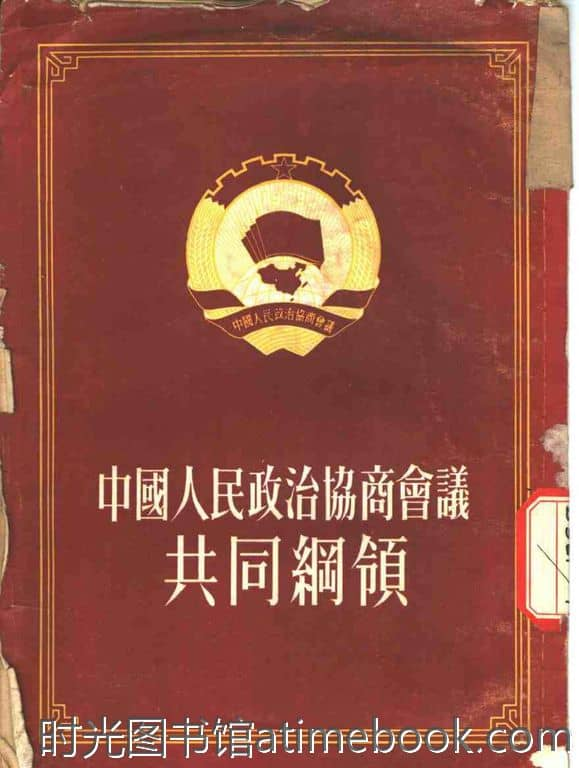
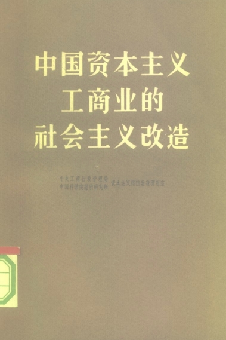
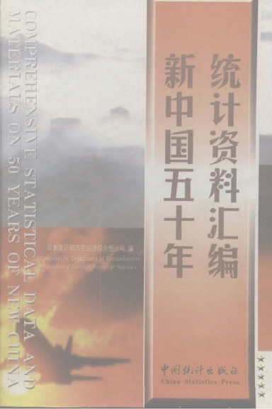
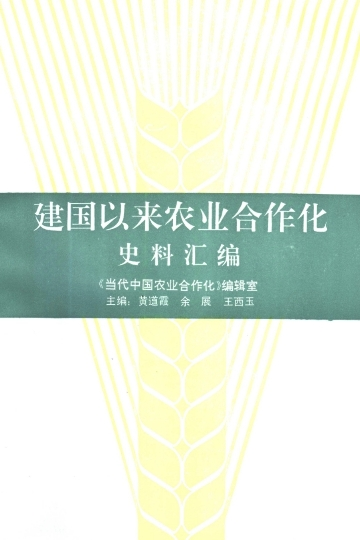

# 关于新中国经济模式变化的资料整理
## 主要目的是整理建国后的经济基础变化含积累率
1949—1952新民主主义时期
1953—1956一五计划时期
1958—1961第一次分权改革时期
1962—1965国民经济调整时期
1966—1976第二次分权改革时期
1978—1984改革开放时期
1985—1990城市化改革时期

# 1949—1952新民主主义时期
​国营经济
​合作社经济
​农民及手工业者的个体经济
​私人资本主义经济
​国家资本主义经济
资料来源《共同纲领》：

## 主要事件
​1. 政权建设与领土统一
​开国大典（1949年10月1日）： 中华人民共和国中央人民政府成立，标志着新民主主义革命在全国范围内的基本胜利。
​《共同纲领》的实施： 中国人民政治协商会议第一届全体会议通过的《共同纲领》，在宪法颁布前起到了临时宪法的作用，确立了新民主主义的国体和政体。
​西藏和平解放（1951年5月）： 中央人民政府与西藏地方政府在北京签订《十七条协议》，标志着中国大陆实现统一。
​2. 民主革命遗留任务的完成
​土地改革运动（1950年—1952年）： * 1950年6月颁布《中华人民共和国土地改革法》。
​彻底废除了封建剥削制度，使约3亿无地或少地的农民分到了土地，极大地解放了农村生产力。
​《婚姻法》的颁布（1950年5月）： 这是新中国第一部法律，废除了包办婚姻和男尊女卑，实行婚姻自由、一夫一妻制，是社会习俗变革的重要里程碑。
​镇压反革命运动（1950年—1951年）： 有效扫清了潜伏在大陆的特务、土匪和反动会道门力量，稳定了社会秩序。
​3. 经济恢复与社会改革
​统一财经与稳定物价（1950年3月）： 通过全国范围内的物资调拨和金融调控，结束了旧中国长达十多年的恶性通货膨胀。
​“三反”“五反”运动（1951年底—1952年）：
​三反： 反贪污、反浪费、反官僚主义（主要在党政机关）。
​五反： 反行贿、反偷税漏税、反盗骗国家财产、反偷工减料、反盗窃国家经济情报（主要在私营工商业）。
​国民经济恢复完成（1952年底）： 到1952年底，中国工农业生产达到并超过了历史最高水平，为接下来的“第一个五年计划”和“三大改造”奠定了物质基础。
​4. 国际关系与军事
​抗美援朝（1950年10月—1953年）： 中国人民志愿军入朝作战。这场战争保卫了新中国的安全，极大地提高了中国的国际地位和民族自信心。
​中苏友好同盟互助条约（1950年2月）： 确立了新中国“一边倒”的外交方针，获得了苏联的经济与技术援助。

# 1953—1956一五计划时期
指令型计划经济
资料来源：《中国资本主义工商业的社会主义改造》《新中国五十年资料汇编》《建国以来农业合作化》

## 主要事件
​1. 工业化的奠基：第一个五年计划 (1953—1957)
​“一五”计划的目标是改变中国“能造茶碗茶具，但连一辆汽车、一架飞机都不能造”的局面，核心是优先发展重工业。
​苏联援建的“156项工程”： 这是工业化的骨架，奠定了中国现代工业的基础。
​标志性成就（1956年集中爆发）：
​长春第一汽车制造厂： 产出第一辆“解放”牌汽车，结束了中国不能造车的历史。
​沈阳第一飞机制造厂： 试制成功第一架喷气式歼击机（歼-5）。
​武汉长江大桥： 1955年开工，1957年通车，“天堑变通途”。
​2. 社会制度的根本变革：三大改造 (1953—1956)
​这是这一时期最深刻的社会变革，标志着社会主义制度在中国正式确立。
​农业： 走集体化道路，从互助组、初级社发展到高级社。
​手工业： 通过生产合作社进行改造。
​资本主义工商业： 采取独特的赎买政策，通过公私合营（全行业公私合营在1956年达到高潮）实现和平过渡。
​结果： 到1956年底，生产资料私有制转变为社会主义公有制，标志着中国进入社会主义初级阶段。
​3. 政治与法治的确立
​第一届全国人民代表大会 (1954年9月)：
​标志着人民代表大会制度作为根本政治制度正式确立。
​通过了**《中华人民共和国宪法》（1954年宪法）**。这是中国第一部社会主义类型的宪法，确立了国家的性质和权力结构。
​4. 外交与思想探索
​和平共处五项原则 (1953/1954)： 逐渐成为国际社会公认的处理国与国关系的基本准则。
​万隆会议 (1955)： 周恩来提出**“求同存异”**方针，使新中国在亚非国家中赢得了广泛支持。
​“双百”方针 (1956)： 毛泽东提出“百花齐放，百家争鸣”，尝试在科学文化领域营造活泼的氛围。
​中共八大 (1956)： 指出国内主要矛盾已转变为人民对于经济文化迅速发展的需要同当前经济文化不能满足人民需要的状况之间的矛盾。这是党对社会主义建设道路的一次成功探索。

# 1958—1961第一次分权改革时期
参与型计划经济
​资料来源：《中国长期统计资料汇编：1949-1989》薄一波《若干重大决策与事件的回顾》陈云《“大跃进”的发动》

## 主要事件
​1. 管理权限的大规模下放（分权核心）
​这是你提到的“分权改革”在制度层面的具体表现：
​企业下放： 1958年，中央将大量企事业单位下放到地方管理。中央直属企业的数量从1957年的9300多个锐减至1958年的1200多个，约80%的企业移交给省、市、自治区。
​计划与财政放权： 实行“以地区平衡为主”的计划体制，扩大了地方在基本建设投资、财政留成和物资分配上的权限。
​基本建设审批权： 地方政府获得了很大程度的投资审批权，导致全国范围内出现了盲目建设和“小而全”的工业体系。
​2. “大跃进”运动 (1958—1960)
​在分权背景下，地方政府为了追求高速度，发起了以**“高指标、瞎指挥、浮夸风、‘共产风’”**为特征的运动。
​全民炼钢： 1958年提出“以钢为纲”，为了实现钢产量翻番的目标，全国动员数千万人上山砍树炼铁，造成了巨大的资源浪费和生态破坏。
​农业高产神话： 各地竞相虚报粮食产量（即“放卫星”），导致国家征购粮食过头，农民留下的口粮严重不足。
​3. 人民公社化运动 (1958年起)
​政社合一： 1958年8月《关于在农村建立人民公社问题的决议》通过。将原来的农业生产合作社合并为规模巨大的“人民公社”。
​平均主义： 实行“大锅饭”（公共食堂）、“军事化管理”，严重挫伤了农民的生产积极性，导致农村劳动力和生产力的严重脱节。
​4. 庐山会议与三年困难时期 (1959—1961)
​庐山会议 (1959)： 彭德怀对“大跃进”中的错误提出意见，却被批判为“右倾”，随后在全国开展“反右倾”斗争，使原本开始纠正的错误进一步升级。
​三年困难时期： 由于“大跃进”和“人民公社化”的体制性偏差，加上自然灾害和苏联撕毁合同，1959年至1961年中国经济陷入严重衰退，出现了全国性的严重饥荒。
​5. 改革的转向：1961年的“八字方针”
​到1960年冬，国民经济已到了崩溃边缘，中央被迫停止“大跃进”，开始收回部分权力。
​八字方针 (1961)： “调整、巩固、充实、提高”。
​主要动作： 缩短基本建设战线，关闭大量亏损的小企业，将下放的权力适度收回中央，并发布了《农村人民公社工作条例（草案）》（简称“六十条”）来纠正“共产风”。

# 1962—1965调整时期
中央计划经济
资料来源：​《陈云文选》（第三卷）《目前的经济形势和克服困难的办法》​《若干重大决策与事件的回顾》（下卷）​《中国长期统计资料汇编：1949-1989》《农村人民公社工作条例修正草案》（农村六十条）

## 主要事件
​1. 政治转折：七千人大会 (1962年1月)
​这是中共历史上规模最大的中央扩大会议，也是调整时期的开端。
​自我批评： 毛泽东、刘少奇等领导人对“大跃进”以来的错误进行了初步总结。
​“三分天灾，七分人祸”： 刘少奇在会上提出的这一诊断，反映了党内对经济困难原因的深刻反思。
​意义： 会议发扬了党内民主，初步统一了思想，为全面调整国民经济扫清了障碍。
​2. 经济上的“大收缩”与“大调整”
​为了应对饥荒和工业瘫痪，中央果断实施了**“调整、巩固、充实、提高”**的八字方针：
​压缩基建： 停建、缓建了大量缺乏条件的工业项目，将资金投向最紧迫的农业和轻工业。
​精减城镇人口： 为了减轻城市的粮食供应压力，1961年至1963年间，约有2600万城镇人口被动员回农村支援农业。
​农村政策放宽（“三自一包”）： 在刘少奇、陈云、邓小平等人的主持下，农村恢复了自留地、自由市场、自负盈亏，并尝试“包产到户”。这极大地提高了农民生产积极性，使农业产能在短时间内迅速回升。
​3. 工业与科技的重大突破
​尽管处于调整期，但中国在某些关键领域取得了“争气”的成就：
​大庆油田与石油自给（1963年）： 1963年底，周恩来宣布中国需要的原油已基本自给。这打破了西方和苏联的能源封锁，使中国摘掉了“贫油国”的帽子。
​第一颗原子弹爆炸成功（1964年10月16日）： 标志着中国国防现代化进入新阶段，极大提升了国际地位。
​三线建设的启动（1964年）： 出于战备考虑，中央决定在云、贵、川等中西部腹地建设战略后方基地。
​4. 社会与政治领域的“山雨欲来”
​在经济好转的同时，政治导向开始发生微妙变化：
​社会主义教育运动（“四清”运动）： 1963年起在农村和城市开展。初衷是清理账目、仓库、财物和工分，但逐渐演变为阶级斗争的预演。
​学雷锋运动（1963年起）： 塑造了时代的道德典范。
​“大中之大”的辩论： 党内对于“经济手段（如包产到户）”还是“政治挂帅”作为驱动力产生了严重分歧，这为后来1966年文革的爆发埋下了伏笔。

#  1966—1976第二次分权改革时期
参与性计划经济
资料来源：《中国长期统计资料汇编：1949-1989》《关于工业发展的几个问题》（工业二十条）​《当代中国的经济体制改革》（吴敬琏）

## 主要事件
1. 核心：1970年的“大下放”
​这是你提到的“分权”在制度上的集中爆发点：
​企业再次下放： 1970年，中央再次将大量骨干企业下放。到1970年底，中央直属企业的产值仅占全国工业总产值的8%左右。
​财政“大包干”： 实行“收支挂钩、比例分成、收支包干”的体制，极大地扩大了地方政府的财权。
​物资与计划下放： 绝大多数物资不再由国家统一分配，而是交由地方自行调配，旨在建立各省“自成体系”的工业体系。
​2. “五小工业”的崛起（农村工业化的雏形）
​为了实现地方自给自足，中央鼓励各地兴办：小钢铁、小机械、小化肥、小水泥、小电力。
​影响： 这虽然造成了资源分散和效率低下，但客观上在广大的农村和县域地区撒下了工业化的“种子”。后来80年代乡镇企业的异军突起，很大程度上受益于这一时期积累的技术人员和设备基础。
​3. 三线建设的巅峰期 (1964—1975)
​受中苏关系破裂和美越战争影响，这一时期国家投入巨资在云、贵、川、陕等大后方建设工业基地。
​“备战”逻辑： 奉行“靠山、分散、隐蔽”的原则。
​空间分权： 这种建设强行改变了中国工业“东重西轻”的格局，成昆铁路、攀枝花钢铁基地等都在此时建成。虽然代价高昂，但确实在战略后方建立了一套完整的工业体系。
​4. 经济的震荡与“局部复苏”
​文革初期的冲击（1967—1968）： 工厂停工、武斗干扰，导致国民经济出现负增长。
​1972年的“四三方案”： 这是一个意外的转折。在中美关系破裂后的“冰破”期，中国利用外汇从西方引进价值43亿美元的成套设备（主要是化肥、化纤、电站），这为后来80年代的民生改善奠定了基础。
​1975年的“全面整顿”： 邓小平主持中央工作期间，试图纠正文革错误，恢复生产秩序，经济出现了短暂但强劲的回升。
​5. 1976：剧变之年
​三位伟人逝世： 周恩来、朱德、毛泽东相继逝世。
​唐山大地震： 经济与社会承受了巨大的自然灾害打击。
​文革结束： 10月，江青反革命集团被粉碎，长达十年的动荡结束，中国站在了改革开放的门槛前。

# 1978—1984改革开放时期
中央计划经济
资料来源：​《邓小平文选》（第二、三卷）​《建国以来重要文献选编》（相关卷次）吴敬琏：《当代中国的经济体制改革》

## 主要事件
1. 伟大的转折：十一届三中全会 (1978年12月)
​这是改革开放的逻辑起点。
​重心转移： 停止“以阶级斗争为纲”，将全党工作重心转移到社会主义现代化建设上来。
​思想解放： 确立了“实事求是”的思想路线，为后续所有突破常规的经济实验发放了“准考证”。
​2. 农村改革：小岗村与家庭联产承包责任制
​改革最先从体制最薄弱、民生最迫切的农村爆发。
​包产到户： 1978年安徽凤阳小岗村农民自发签署“生死契约”。随后，中央逐步肯定了这种形式，形成了家庭联产承包责任制。
​政社分开： 到1983年，人民公社体制基本瓦解，恢复乡镇政府，极大地释放了亿万农民的生产积极性，解决了中国人的吃饭问题。
​乡镇企业异军突起： 农民开始“离土不离乡”，从事加工业和服务业，成为中国工业化的一支奇兵。
​3. 对外开放：特区的“窗口”效应
​中国开始重新审视世界，通过设立“试验田”引入资本、技术和管理。
​四大特区 (1980)： 深圳、珠海、汕头、厦门。深圳从一个边陲小镇迅速崛起为现代化城市，成为“时间就是金钱，效率就是生命”的代名词。
​沿海开放城市 (1984)： 中央决定进一步开放大连、秦皇岛、天津、烟台、青岛、上海、广州等14个沿海港口城市，对外开放由点及面展开。
​4. 城市改革的破冰：从试点到全面展开
​放权让利： 初期的城市改革主要是给国有企业“松绑”，允许企业留存一部分利润作为奖金或发展基金。
​1984年《关于经济体制改革的决定》： 这是该阶段的终点，也是下一个阶段的起点。
​明确了中国社会主义经济是**“在公有制基础上的有计划的商品经济”**。
​标志着改革重心正式从农村转向以城市为中心的全面经济体制改革。
​5. 外交与社会新气象
​中美建交 (1979)： 1979年1月1日正式建交，同年邓小平访美，为改革开放争取了有利的国际环境。
​中英联合声明 (1984)： 正式签署关于香港问题的联合声明，确立了“一国两制”的构想。
​消费革命： 彩电、冰箱、洗衣机“三大件”开始进入富裕家庭，社会生活告别了单调的蓝灰色，进入了追求物质改善的新时期。

# 1985—1990城市化改革时期
社会主义市场经济
资料来源：​《中国统计年鉴 (1986—1991)》​《中国工业经济统计资料》《理顺物价，加快改革》雅诺什·科尔奈：《短缺经济学》

## 主要事件
​1. 城市经济体制改革的全面展开
​1984年底的决策在1985年进入实操阶段，重点是增强企业活力：
​厂长负责制： 改变了过去党委包揽一切的做法，赋予厂长（经理）在生产经营上的自主权。
​两步利改税： 变“上缴利润”为“依法纳税”，初步理顺了国家与企业的分配关系。
​租赁制与股份制试点： 1986年，沈阳防爆器械厂成为新中国第一家宣告破产的集体企业，打破了“大锅饭”的铁饭碗。
​2. “价格双轨制”与1988年“价格闯关”
​这是该时期最显著的特征，也是矛盾最集中的领域：
​双轨制： 同一种物资（如钢材、煤炭），计划内部分按低价拨付，计划外部分按市场高价买卖。
​初衷与副作用： 初衷是为了减少改革阻力，但导致了“官倒”（倒卖批文）现象严重，腐败问题凸显。
​价格闯关（1988）： 政府试图通过“短痛”一次性解决价格扭曲。但由于预期失控，引发了全国性的抢购风潮和恶性通货膨胀（CPI一度接近20%），改革被迫中止，进入“治理整顿”。
​3. 沿海开放战略的深化
​沿海经济开放区（1985）： 将长江三角洲、珠江三角洲和闽南三角地区开辟为沿海经济开放区。
​海南建省与最大特区（1988）： 海南脱离广东正式建省，并成为中国最大的省级经济特区，标志着对外开放向纵深发展。
​浦东开发的战略构想： 虽然正式开发在1990年，但80年代末已开始酝酿这一带动长江流域发展的“龙头”计划。
​4. 政治与法治的初步建设
​《破产法》与《民法通则》： 1986年颁布，为商品经济的运行提供了基本的法律框架。
​政治体制改革的探索： 1987年中共十三大提出“党政分开”和“差额选举”，试图配合经济改革进行政治体制的局部微调。
​5. 治理整顿与转向 (1989—1990)
​由于1988年的通胀压力和1989年的政治波动，改革进入了一个相对沉寂的“治理整顿”期：
​压缩规模： 严格控制基本建设投资和信贷规模，平抑物价。
​市场化的坚持： 尽管宏观环境严峻，但1990年上海证券交易所和深圳证券交易所的先后开业，标志着中国资本市场在风雨中诞生，改革的火种并未熄灭。

# 积累率统计
## 1949—1952 15% — 21% 新民主主义时期
## 1953—1957 23% — 25% 一五计划时期
## 1958—1960 33.9% — 43.8% 第一次分权改革时期
## 1962—1965 10.4% — 22% 国民经济调整时期
## 1970—1976 31% — 34% 第二次分权改革时期
## 1978—1984 28% — 32% 改革开放时期
## 1985—1990 34% — 35% 城市化改革时期
补充：积累率=累积基金/国民收入使用额×100%
​《中国长期统计资料汇编：1949-1989》（国家统计局编）​《新中国五十年统计资料汇编》（1999年版）
